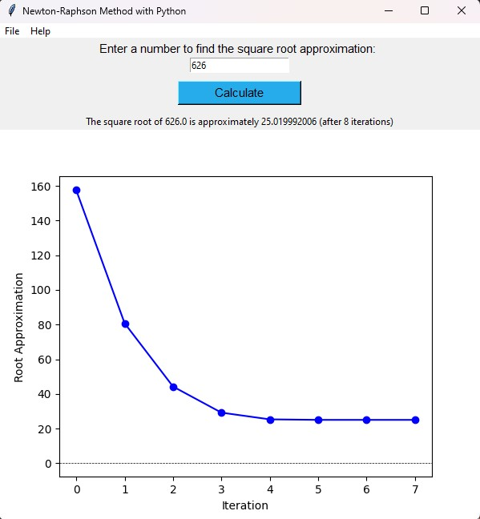

# Newton-Raphson-Method-with-Python

## Description
The Newton-Raphson Method (or Newton's Method) is an iterative numerical technique used to find the roots of a function. It starts with an initial guess and iteratively refines this guess until it approaches the roots of a function. The method is based on linear approximation and requires the calculation of both the function and its derivative. The newton-raphson method is widely utilized in several computational and mathematical applications such as in calculators and mathematical software packages. This project demonstrates the Newton-Raphson Method in Python, providing a simple and efficient way to approximate the roots of a quadratic function.



## Project Overview
This project aims to implement the Newton-Raphson Method in Python to approximate the roots of a quadratic function. It provides a user-friendly interface where a user can input a number and calculate its approximate square root using the Newton-Raphson Method. The application includes features such as graphing the root approximations over iterations and saving the graph as an image file.

### Technologies Used: 
**__Python:__** The core programming language used for implementing the Newton-Raphson Method. \ \
**__Tkinter Library:__** Python's standard GUI (Graphical User Interface) toolkit which was used to create the user interface for the application \ \
**__Matplotlib Library:__** A comprehensive library for creating static, animated, and interactive visualizations in Python. This library was used in the program for plotting the graph of the root approximations over iterations. 

```
import tkinter as tk
from tkinter import filedialog
import matplotlib.pyplot as plt
from matplotlib.backends.backend_tkagg import FigureCanvasTkAgg
import webbrowser
```

### Implementation of the Newton-Raphson Method Iteration:
Quadratic function to evaluate: x<sup>2</sup> - number \
> number is the value the user enters, the program will calculate the approximate root of that
Derivative of function: 2x \

Iteration step in the Newton-Raphson method: \
x<sub>n</sub> = x - (f(x) / f′(x))
```
# Calculate the next approximation of the square root using the newton-raphson method iteration
x_of_n = x - ((x * x - number) / (2 * x))
```
